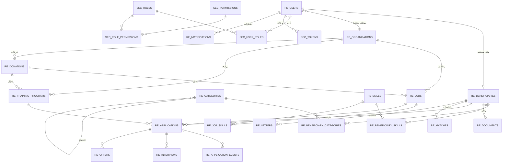

# مخطط العلاقات (ERD)



## ملاحظات تصميمية
- **توحيد المستخدم**: `RE_USERS` جدول واحد لكل الأنواع لتبسيط المصادقة؛ التمييز عبر
  `user_type` + الأدوار. المستفيد يرتبط 1:1 بـ `RE_BENEFICIARIES`، وموظف المنظمة عبر `org_id`.
- **توحيد الطلب**: `RE_APPLICATIONS` يخدم الوظائف والتدريب عبر `target_type` مع قيد تحقق
  يضمن ملء `job_id` أو `program_id` حصراً.
- **التبرع كمورد قابل للاستهلاك**: `units_pledged`/`units_consumed` مع قيد يمنع التجاوز.
- **التصنيفات هرمية** عبر `parent_id` وبأنواع (مجال/مؤهل/مستوى/وظيفة).
```
